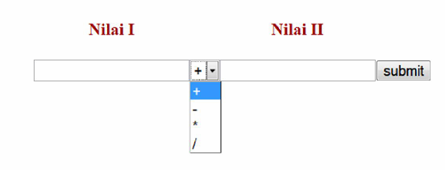

# Course 5
PHP, Create Simple Calculator

## Tag
- HTML
- CSS
- Form
- PHP
- Xampp

## Tugas 5
- Buat kalkulator sederhana dengan php, tampilan boleh kreasi sendiri :

## Reference
- [w3s](https://www.w3schools.com/html/html_formatting.asp)
- [Bootstrap](https://getbootstrap.com/)
- [php](https://www.php.net/manual/en/index.php)
